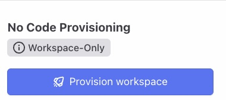
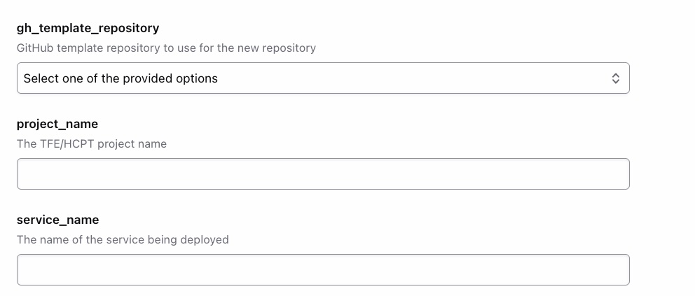
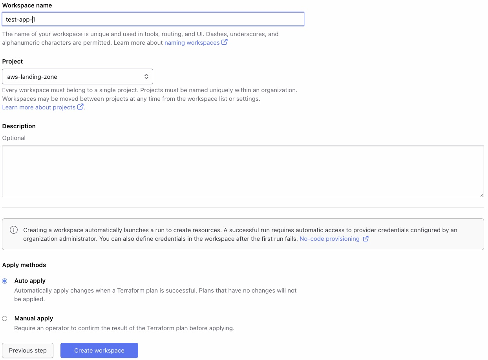
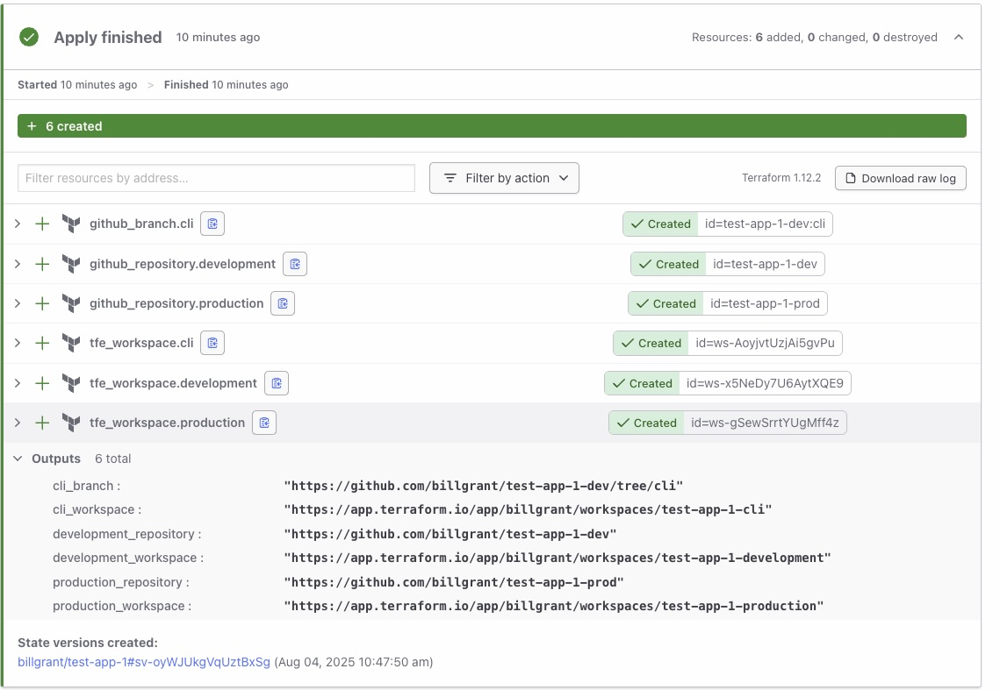
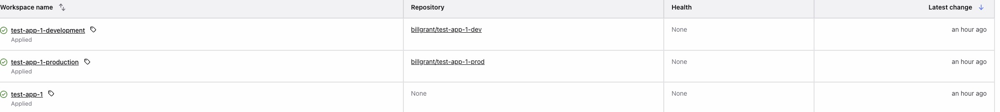
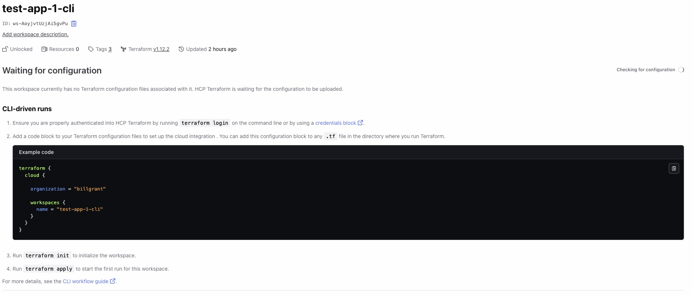

# HCP Terraform AWS Landing Zone No-Code Module

## Overview

### This module creates [HCP Terraform Workspaces](https://developer.hashicorp.com/terraform/cloud-docs/workspaces) and related Github repositories.

#### Full Details

- Creates three workspaces
  - cli (cli)
  - dev (VCS)
  - prod (VCS)
- Creates Github repos for all three workspaces
  - dev and cli will use the same repo. cli will be in the cli branch.
  - prod will has it's own repo
  - Repos include boilerplate code that can be used for examples
- Outputs will provide links to created workspaces and Github Repositories

## Instructions for Use

Navigate to the landingzone-aws module in the private registry.

Select Provision Workspace:

Enter in the required input variables

Name the workspace, select the project and click Create workspace

When the apply completes the links to created workspaces and github repositories will be provided.

Here is a look at the three workspaces that were created

## CLI workspace setup

The setup for the CLI workspace is provided in the workspaces overview.

